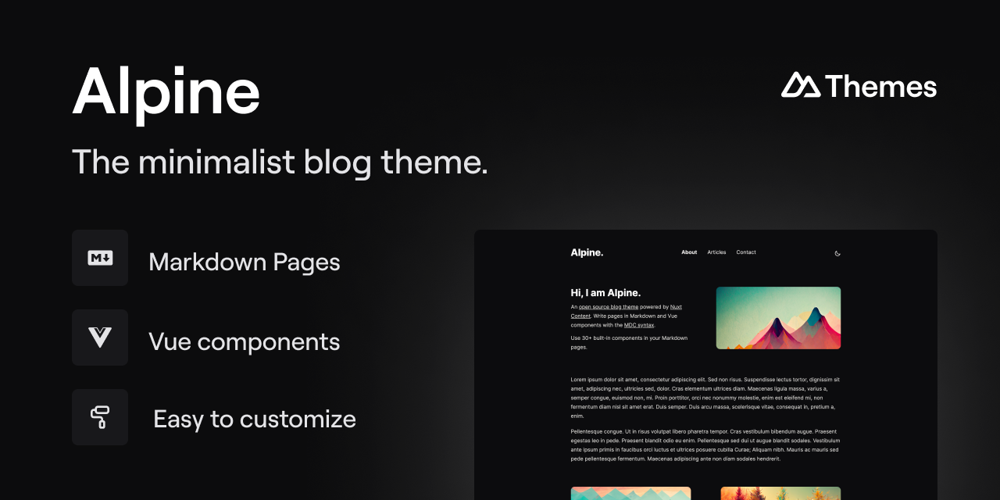

[](https://alpine.nuxt.space)

# Alpine

[![npm version][npm-version-src]][npm-version-href]
[![License][license-src]][license-href]
[![npm downloads][npm-downloads-src]][npm-downloads-href]
[![Nuxt][nuxt-src]][nuxt-href]
[![Nuxt Studio][nuxt-studio-src]][nuxt-studio-href]
[![Volta][volta-src]][volta-href]

The minimalist blog theme, powered by [Nuxt](https://nuxt.com).


- [📸 Online demo](https://alpine.nuxt.space)
- [⚡️ Play on StackBlitz](https://stackblitz.com/github/nuxt-themes/alpine-starter)

## Features

- Start from a **profile page**, scale to a **complete blog**!
- An [open source blog theme](https://github.com/nuxt-themes/alpine) powered by [Nuxt Content](https://content.nuxtjs.org), editable from [Nuxt Studio](https://nuxt.studio).
- Write pages in Markdown and Vue components with the [MDC syntax](https://content.nuxtjs.org/guide/writing/mdc).
- Use [**30+ built-in**](https://elements.nuxt.space) components in your Markdown pages.

## Quick Start

```bash
npx nuxi@latest init -t themes/alpine
```

## Contributing 🙏

1. Clone this repository
2. Install dependencies using `pnpm install`
3. Run `pnpm prepare` to generate type stubs.
4. Use `pnpm dev` to start [playground](./playground) in development mode.

## License

[MIT](./LICENSE)

<!-- Badges -->
[npm-version-src]: https://img.shields.io/npm/v/@nuxt-themes/alpine/latest.svg?style=flat&colorA=18181B&colorB=28CF8D
[npm-version-href]: https://npmjs.com/package/@nuxt-themes/alpine

[npm-downloads-src]: https://img.shields.io/npm/dt/@nuxt-themes/alpine.svg?style=flat&colorA=18181B&colorB=28CF8D
[npm-downloads-href]: https://npmjs.com/package/@nuxt-themes/alpine

[license-src]: https://img.shields.io/github/license/nuxt-themes/alpine.svg?style=flat&colorA=18181B&colorB=28CF8D
[license-href]: https://github.com/nuxt-themes/alpine/blob/main/LICENSE


[nuxt-src]: https://img.shields.io/badge/Nuxt-18181B?&logo=nuxt.js
[nuxt-href]: https://nuxt.com

[nuxt-studio-src]: https://img.shields.io/badge/Open%20in%20Nuxt%20Studio-18181B?&logo=nuxt.js&logoColor=3BB5EC
[nuxt-studio-href]: https://nuxt.studio/themes/alpine

[volta-src]: https://user-images.githubusercontent.com/904724/209143798-32345f6c-3cf8-4e06-9659-f4ace4a6acde.svg
[volta-href]: https://volta.net/nuxt-themes/alpine?utm_source=readme_alpine
